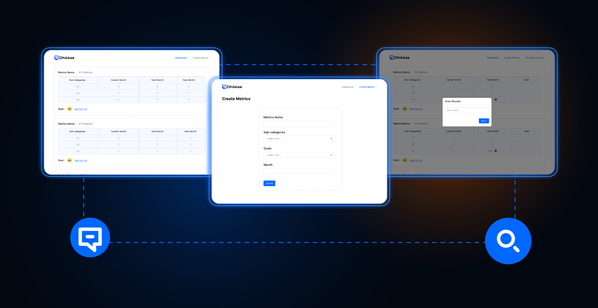

# Metrics Mapping with Goal Management



This project is build to manage metrics with months assigned with a goal.
You can create new metrics and assigns targets for current and next months.
for managing metrics and goals, ClickUp and Supabase Rest APIs are used.

This project is generated with ❤️ from DhiWise

## Table of Contents
- [Features](#features)
- [Design System](#design-system)
- [API Information](#api-information)
- [Version](#version)
- [Setup](#setup)
- [Folder Structure](#folder-structure)
- [Story Book Setup](#story-book-setup)
- [License](#license)
- [Community](#community)

### Features
1. create new metrics.
2. map metrics with goals from ClickUp
3. Add targets for particular month
4. See goal and its tasks in ClickUp of Specific Metrics.

### Design System
All the design has been generated with [tailwindcss](https://tailwindcss.com/).
Find all the theme related configuration inside tailwind.config.js

This project was bootstrapped with [Create React App](https://github.com/facebook/create-react-app).

This project is integrated with a [Tailwind CSS](https://tailwindcss.com/) setup, a new utility-first css framework, in an CRA environment. You can read more over on [Getting Started with Tailwind](https://tailwindcss.com/docs/installation).

Figma: https://www.figma.com/file/ydymsJ3zyOSPfLBfy6ZUZA/Metric-management?node-id=0%3A1

### API Information
1. [ClickUp APIs](https://clickup.com/api)
2. [Supabase APIs](https://supabase.com/docs/guides/api#rest-api-overview)

### Versions
- [NodeJS](https://nodejs.org/en/) - `12 || 14 `
- [npm](https://www.npmjs.com/) - v6 or greater

### Setup
1. clone the repo
2. ```npm i```
3. add credentials of ClickUp and Supabase in src/constants/credentials.js 
4. ```npm run start```

> Note: If you face a cors error: use this https://cors-anywhere.herokuapp.com/ as your API URL prefix and Run this demo https://cors-anywhere.herokuapp.com/corsdemo. 

### Folder Structure
```
├── package.json
├── package-lock.json
├── postcss.config.js
├── public
│   ├── favicon.ico
│   ├── index.html
│   ├── logo192.png
│   ├── logo512.png
│   ├── manifest.json
│   └── robots.txt
├── README.md
├── src
│   ├── App.js
│   ├── assets
│   │   ├── fonts ---------- Project fonts
│   │   └── images --------- All Project Images
│   ├── components --------- UI and Detected Common Components
│   ├── constants ---------- Project constants, eg: string consts
│   ├── hooks -------------- Helpful Hooks
│   ├── index.js
│   ├── pages -------------- All route pages
│   ├── Routes.js ---------- Routing
│   ├── styles
│   │   ├── index.css ------ Other Global Styles
│   │   └── tailwind.css --- Default Tailwind modules
│   └── util
│       └── index.js ------- Helpful utils
└── tailwind.config.js ----- Entire theme config, colors, fonts etc.
```

### Story Book Setup
1. ```npx storybook init```
2. ```npm run storybook```

### License
MIT License
Copyright (c) 2022 DhiWise

Permission is hereby granted, free of charge, to any person obtaining a copy of this software and associated documentation files (the "Software"),to deal in the Software without restriction, including without limitation the rights to use, copy, modify, merge, publish, distribute, sublicense, and/or sell copies of the Software, and to permit persons to whom the Software is furnished to do so, subject to the following conditions:

The above copyright notice and this permission notice shall be included in all copies or substantial portions of the Software.

THE SOFTWARE IS PROVIDED "AS IS", WITHOUT WARRANTY OF ANY KIND, EXPRESS OR IMPLIED, INCLUDING BUT NOT LIMITED TO THE WARRANTIES OF MERCHANTABILITY, FITNESS FOR A PARTICULAR PURPOSE AND NON-INFRINGEMENT. IN NO EVENT SHALL THE AUTHORS OR COPYRIGHT HOLDERS BE LIABLE FOR ANY CLAIM, DAMAGES OR OTHER LIABILITY, WHETHER IN AN ACTION OF CONTRACT, TORT OR OTHERWISE, ARISING FROM, OUT OF OR IN CONNECTION WITH THE SOFTWARE OR THE USE OR OTHER DEALINGS IN THE SOFTWARE.

### DhiWise Community

<a href="https://twitter.com/dhiwise"></a>

<a href="https://www.youtube.com/c/DhiWise"></a>

<a href="https://discord.com/invite/rFMnCG5MZ7"></a>

<a href="https://docs.dhiwise.com/"></a>
